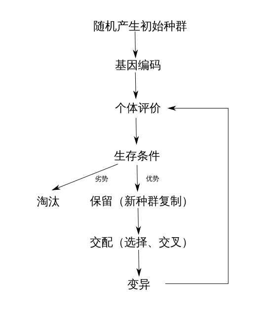
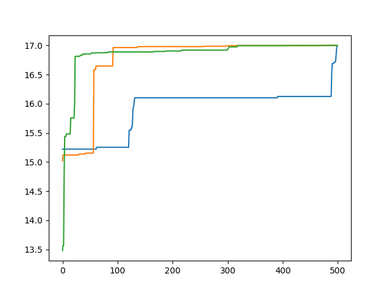

# CMOS-AO

The Automatic optimization of CMOS tables.

## 遗传算法概括

--------------------------------------------------------------------------------

### 达尔文式进化论

#### 概括

- 过渡繁殖
- 生存斗争
- 遗传变异
- 适者生存

#### 流程图

#### 效果图

横轴为训练轮数 纵轴为适应结果

> - results[-1] [16.999948082031757, 14.136631366924039]
> - best_individual [1, 1, 1, 0, 0, 0, 1, 1, 0, 0, 0, 1, 1, 1, 1]
> - best_fit 16.948576227695426
> - obj_value[1] 16.09522023064174
> - y = 16.999948, x = 14.136631

### 拉马克式进化论*

#### 概括

- 用进废退
- 获得性遗传

> 机器学习历程：传统机器学习法（包含爬山、蚁群、遗传） > 深度学习 > 强化学习 > 迁移学习

> 传统机器学习算法：输入——人工特征提取——权重学习——预测结果

> 深度学习算法：输入——基础特征提取——多层复杂特征提取——权重学习——预测结果

强化学习是机器学习中的一个领域，强调如何基于环境而行动，以取得最大化的预期利益。
